# Claude Code Docker Runner

Run claude code in somewhat safe and isolated yolo mode

## Features

- 🚀 **Standalone Script**: Single file contains everything - Dockerfile, MCP servers, configuration
- 🤖 **Pre-configured MCP Servers**: Unsplash, Context7, Playwright, and Serena ready to use
- 🧩 **Plugins baked in**: Detects host plugins and bakes them into the image at build time
- ⚡ **SuperClaude**: 30+ `sc:*` slash commands for structured development workflows
- 🔧 **Auto-build**: Automatically builds Docker image if it doesn't exist
- 🔒 **Secure**: Host system protected by Docker boundaries with read-only mounts
- ⚡ **Fast Setup**: No manual Docker builds or MCP configuration needed
- 🔄 **Persistent Container**: Reuses existing container for faster startup

## Table of Contents

- [Quick Start](#quick-start)
  - [Prerequisites](#prerequisites)
  - [Basic Usage](#basic-usage)
- [Script Options](#script-options)
  - [Build Commands](#build-commands)
  - [Runtime Options](#runtime-options)
  - [Container Persistence](#container-persistence)
- [What's Included](#whats-included)
  - [Embedded Dockerfile](#embedded-dockerfile)
  - [MCP Servers](#mcp-servers)
  - [Environment Variables](#environment-variables)
  - [Volume Mounts](#volume-mounts)
- [Serena (Semantic Code Analysis)](#serena-semantic-code-analysis)
  - [Running a Persistent Host Server](#running-a-persistent-host-server)
  - [How the Fallback Works](#how-the-fallback-works)
- [SuperClaude Commands](#superclaude-commands)
- [Testing the Setup](#testing-the-setup)
- [Advanced Usage](#advanced-usage)
  - [Custom Image Names](#custom-image-names)
  - [Verbose Output](#verbose-output)
  - [Environment Variable Setup](#environment-variable-setup)
- [Security Notes](#security-notes)
  - [Container Security](#container-security)
  - [Dangerous Permissions](#dangerous-permissions)
  - [Best Practices](#best-practices)
- [Troubleshooting](#troubleshooting)
  - [Permission Issues](#permission-issues)
  - [Authentication Issues](#authentication-issues)
  - [Image Not Found](#image-not-found)
  - [Container Management](#container-management)
- [How It Works](#how-it-works)
- [Contributing](#contributing)
  - [Development Workflow](#development-workflow)
  - [Key Points for Contributors](#key-points-for-contributors)
  - [Testing Container Changes](#testing-container-changes)
- [Visual Workflow](#visual-workflow)

## Quick Start

### Prerequisites

- Docker installed and running
- Claude authentication configured (`claude auth`)
- Environment variables for MCP servers (e.g., `UNSPLASH_ACCESS_KEY`)

### Basic Usage

```bash
# Download the script (single file needed)
curl -O https://raw.githubusercontent.com/icanhasjonas/run-claude-docker/main/run-claude.sh
chmod +x run-claude.sh

# Interactive shell (auto-pulls from Docker Hub on first run, reuses existing container)
./run-claude.sh

# Run specific command
./run-claude.sh claude --dangerously-skip-permissions "analyze this codebase"

# Custom workspace
./run-claude.sh -w /path/to/project

# If run-claude.sh fails due to architecture issues, build locally
./run-claude.sh --build
```

## Script Options

### Build Commands

```bash
# Build Docker image and exit
./run-claude.sh --build

# Force rebuild image and continue
./run-claude.sh --rebuild
```

### Runtime Options

```bash
# Custom workspace
./run-claude.sh -w /path/to/project

# Custom Claude config path
./run-claude.sh -c /path/to/.claude

# Custom container name (default: claude-code)
./run-claude.sh -n my-claude-container

# Custom image name
./run-claude.sh -i my-claude:v1.0

# One-shot with cleanup (removes container after exit)
./run-claude.sh --rm --no-interactive claude auth status

# Safe mode (no dangerous permissions)
./run-claude.sh --safe

# Non-interactive mode
./run-claude.sh --no-interactive

# Recreate container (remove existing and create new)
./run-claude.sh --recreate

# Help
./run-claude.sh --help
```

### Container Persistence

By default, the script creates a persistent container named `claude-code` that is reused across runs:

- **First run**: Creates and starts the container
- **Subsequent runs**: Reuses the existing container for faster startup
- **Container running**: Executes commands in the running container
- **Container stopped**: Restarts the existing container preserving all changes

This behavior significantly reduces startup time and preserves any modifications made inside the container (installed packages, configuration changes, etc.).

## What's Included

### Embedded Dockerfile

The script contains a complete Dockerfile that includes:

- Ubuntu 22.04 base image
- Claude Code installation
- Go, Node.js, Python, and build tools
- Pre-built Unsplash MCP server
- All MCP servers pre-configured

### MCP Servers

Automatically configured and ready to use:

- **Unsplash**: Photo search and download (`unsplash-mcp-server`)
- **Context7**: AI context service (`https://mcp.context7.com/mcp`)
- **Playwright**: Browser automation (`@playwright/mcp@latest`)
- **Serena**: Semantic code analysis with LSP integration (see [Serena section](#serena-semantic-code-analysis))

### Environment Variables

#### Script Configuration

- `CLAUDE_CODE_IMAGE_NAME` - Override default Docker Hub image (default: `icanhasjonas/claude-code`)

#### Automatically forwarded from host

- `UNSPLASH_ACCESS_KEY`
- `OPENAI_API_KEY`
- `NUGET_API_KEY`
- `CLAUDE_DANGEROUS_MODE=1`
- `NODE_OPTIONS=--max-old-space-size=8192`
- `TERM` - Terminal settings for proper color support

#### Claude Authentication Forwarding

The script automatically forwards Claude authentication and OAuth credentials from your host system:

- **OAuth Account**: Preserves your Claude login session
- **User Settings**: Maintains preferences and onboarding state
- **Permissions**: Automatically enables bypass permissions mode in container
- **Subscription**: Forwards subscription and access cache information

This ensures seamless authentication without needing to re-login inside the container.

### Volume Mounts

Automatically mounted:

- Workspace: `$(pwd)` → `/home/$(whoami)/workspace`
- Claude config: `~/.claude` → `/home/$(whoami)/.claude`
- SSH keys: `~/.ssh` → `/home/$(whoami)/.ssh` (read-only)
- Git config: `~/.gitconfig` → `/home/$(whoami)/.gitconfig` (read-only)

### Authentication Integration

The script makes a best effort to forward your Claude authentication into the container session:

- **Seamless Login**: Your existing Claude authentication is automatically available (after initial setup)
- **OAuth Preservation**: Maintains your logged-in state and subscription access
- **Config Merging**: Intelligently merges host Claude configuration with container settings
- **Permission Bypass**: Automatically enables bypass permissions mode for streamlined operation

**Important:** On your first run, you may need to run `claude /login` inside the container. After that initial authentication, your login state is preserved and forwarded automatically for future runs.

## Serena (Semantic Code Analysis)

[Serena](https://github.com/oraios/serena) is an MCP server that provides intelligent code understanding, refactoring, and navigation through language server protocol (LSP) integration. It is always installed in the container image.

### Running a Persistent Host Server

By default, Serena runs as a child process (stdio) inside each Claude session. For better performance, you can run a persistent Serena server on the host and have containers connect to it over HTTP.

**Benefits of a host-side server:**
- **Warm LSP cache** -- language server stays running, so symbol lookups are instant
- **Single process** -- no startup cost per Claude session
- **Web dashboard** -- monitor Serena's activity at `http://localhost:8765`
- **Shared knowledge** -- Serena's memories persist across all container sessions (they're stored in `.serena/memories/` inside your project, which is already mounted)

**Start the server on your host:**

```bash
# Install uv if you don't have it
curl -LsSf https://astral.sh/uv/install.sh | sh

# Start Serena with HTTP transport (run from your project directory)
uvx --from git+https://github.com/oraios/serena serena start-mcp-server \
    --transport streamable-http \
    --port 8765 \
    --project-from-cwd \
    --enable-web-dashboard true
```

Then launch your container as usual. The entrypoint automatically detects the host server and connects.

You can customize the port with the `SERENA_PORT` environment variable:

```bash
SERENA_PORT=9000 ./run-claude.sh
```

### How the Fallback Works

On every container startup, the entrypoint script checks if `localhost:8765` (or `$SERENA_PORT`) is reachable:

- **Host server running** -- Serena is reconfigured to use HTTP transport (`http://localhost:8765/mcp`). This works because containers run with `--network host`.
- **No host server** -- Serena uses its built-in stdio transport, spawning a local instance via `uvx`. Project data in `.serena/` (config, memories) still persists through the workspace mount.

Either way, Serena works out of the box with no manual configuration.

## SuperClaude Commands

The image includes [SuperClaude](https://github.com/SuperClaude-Org/SuperClaude_Framework), which adds 30+ structured slash commands for development workflows. These are installed during image build via `uvx superclaude install` and available as `/sc:*` commands.

**Available commands include:**

| Category | Commands |
|----------|----------|
| Development | `/sc:implement`, `/sc:build`, `/sc:design` |
| Analysis | `/sc:analyze`, `/sc:troubleshoot`, `/sc:explain` |
| Quality | `/sc:improve`, `/sc:test`, `/sc:cleanup` |
| Planning | `/sc:estimate`, `/sc:brainstorm`, `/sc:spec-panel` |
| Project | `/sc:git`, `/sc:document`, `/sc:task`, `/sc:workflow` |
| Research | `/sc:research`, `/sc:index`, `/sc:index-repo` |

Run `/sc:help` inside a Claude session for the full list.

## Testing the Setup

### 1. First Run (Auto-pull)

```bash
# First run will automatically pull the pre-built image from Docker Hub
./run-claude.sh claude auth status

# If not authenticated, you'll need to login (usually only required once)
./run-claude.sh claude /login

# Test MCP servers are working
./run-claude.sh claude "search for sunset photos on unsplash"
```

### 2. Test Build Commands

```bash
# Build image only (useful for CI/CD)
./run-claude.sh --build

# Force rebuild (get latest updates)
./run-claude.sh --rebuild
```

### 3. Test File Operations

```bash
# Create test project
mkdir test-project
cd test-project
echo "console.log('hello');" > test.js

# Test Claude with file modification
./run-claude.sh claude --dangerously-skip-permissions "add error handling to test.js"

# Check if file persists on host
cat test.js
```

### 4. Test MCP Integration

```bash
# Test Unsplash MCP
./run-claude.sh claude "find a photo of mountains using unsplash"

# Test Playwright MCP
./run-claude.sh claude "take a screenshot of google.com"
```

## Advanced Usage

### Custom Image Names

```bash
# Use custom image name
./run-claude.sh -i my-claude:v1.0

# Build with custom name
./run-claude.sh -i my-claude:v1.0 --build
```

### Verbose Output

```bash
# Show docker command being executed
RUN_CLAUDE_VERBOSE=1 ./run-claude.sh

# Example output:
# Running Claude Code container...
# Command: docker run --rm -it --privileged --name claude-code-1234567890 ...
```

### Environment Variable Setup

```bash
# Set required environment variables
export UNSPLASH_ACCESS_KEY="your-key-here"
export OPENAI_API_KEY="your-openai-key"

# Use custom Docker image
export CLAUDE_CODE_IMAGE_NAME="myregistry/my-claude-code"
./run-claude.sh

# Or use .env file approach
echo "UNSPLASH_ACCESS_KEY=your-key" >> ~/.bashrc
source ~/.bashrc
```

## Security Notes

### Container Security

- ✅ **Host isolation**: Host system protected by Docker boundaries
- ✅ **Read-only mounts**: SSH keys and system configs mounted read-only
- ✅ **User isolation**: Runs as non-root user inside container
- ✅ **Targeted capabilities**: Uses `SYS_ADMIN` + `seccomp=unconfined` instead of full privileged mode
- ⚠️ **Privileged mode**: Available via `--privileged` flag if explicitly needed

### Dangerous Permissions

- Container uses targeted capabilities for Playwright/Chromium (not full `--privileged`)
- Claude runs with `--dangerously-skip-permissions` by default
- Use `--safe` flag to disable dangerous permissions
- Use `--privileged` flag only if you need full Docker privileged mode
- All file modifications are contained within mounted volumes

### Best Practices

1. Only mount directories you want Claude to access
2. Use read-only mounts for sensitive configs
3. Regularly rebuild image for security updates
4. Monitor container resource usage
5. Use temporary containers (`--rm`) for one-shot commands

## Troubleshooting

### Permission Issues

```bash
# Fix workspace permissions
docker run --rm -v $(pwd):/workspace claude-code:latest sudo chown -R claude:claude /workspace
```

### Authentication Issues

**First Time Setup:**

On your very first run, you may need to authenticate Claude inside the container:

```bash
# Check Claude authentication status
./run-claude.sh claude auth status

# If not authenticated, login (this is usually only needed once)
./run-claude.sh claude /login
```

After the initial `/login`, the script automatically forwards your authentication between the host and container, so you shouldn't need to re-authenticate in future runs.

**Note:** The authentication forwarding works most of the time but isn't bulletproof. If you encounter auth issues, try running `/login` again inside the container.

**Troubleshooting Authentication:**

```bash
# Check Claude config
./run-claude.sh claude auth status

# Re-authenticate if needed
./run-claude.sh claude auth

# Or use the web login method
./run-claude.sh claude /login
```

### Image Not Found

```bash
# Force rebuild image
./run-claude.sh --rebuild

# Or build only
./run-claude.sh --build

# Check existing images
docker images | grep claude
```

### Container Management

```bash
# List containers
docker ps -a | grep claude

# Stop persistent container
docker stop claude-code

# Remove persistent container
docker rm claude-code

# Or use the script to recreate
./run-claude.sh --recreate
```

## How It Works

```
┌─────────────────────────────────────────────────────────────────────────────────┐
│                                HOST SYSTEM                                      │
├─────────────────────────────────────────────────────────────────────────────────┤
│  ./run-claude.sh                                                                │
│      │                                                                          │
│      ├─ 1. Check if Docker image exists                                         │
│      │     ├─ NO  → Build embedded Dockerfile                                   │
│      │     └─ YES → Continue                                                    │
│      │                                                                          │
│      ├─ 2. Check if container exists                                            │
│      │     ├─ RUNNING   → Execute in existing container                         │
│      │     ├─ STOPPED   → Start existing container (preserves state)            │
│      │     └─ MISSING   → Create new container                                  │
│      │                                                                          │
│      └─ 3. Mount volumes & forward env vars                                     │
│             │                                                                   │
│             ▼                                                                   │
├─────────────────────────────────────────────────────────────────────────────────┤
│  DOCKER CONTAINER (Ubuntu 25.04 + Claude + MCP)                                 │
│                                                                                 │
│  ┌─────────────────┐  ┌─────────────────┐  ┌─────────────────┐                  │
│  │   Unsplash MCP  │  │   Context7 MCP  │  │ Playwright MCP  │                  │
│  │   (Pre-built)   │  │   (HTTP/Web)    │  │   (npm global)  │                  │
│  └─────────────────┘  └─────────────────┘  └─────────────────┘                  │
│                                 │                                               │
│  ┌─────────────────────────────────────────────────────────────┐                │
│  │               CLAUDE CODE                                   │                │
│  │         (--dangerously-skip-permissions)                    │                │
│  └─────────────────────────────────────────────────────────────┘                │
│                                 │                                               │
│  ┌─────────────────────────────────────────────────────────────┐                │
│  │  ZSH + Oh-My-Zsh + LazyVim + Dev Tools                      │                │
│  │  • Node.js (via fnm)  • Go  • Python  • Git  • Build tools  │                │
│  └─────────────────────────────────────────────────────────────┘                │
│                                                                                 │
│  MOUNTED VOLUMES (Read/Write):                                                  │
│  • ~/.claude      → Container config                                            │
│  • $(pwd)         → Working directory                                           │
│                                                                                 │
│  MOUNTED VOLUMES (Read-Only):                                                   │
│  • ~/.ssh         → SSH keys                                                    │
│  • ~/.gitconfig   → Git configuration                                           │
│                                                                                 │
│  ENV FORWARDED:                                                                 │
│  • API Keys (Unsplash, OpenAI, etc.)                                            │
│  • CLAUDE_DANGEROUS_MODE=1                                                      │
│  • Claude Authentication & OAuth                                                │
│  • Terminal settings (TERM)                                                     │
└─────────────────────────────────────────────────────────────────────────────────┘

🔒 ISOLATION BENEFITS:
  ✅ Host system protected by Docker boundaries
  ✅ All dangerous operations contained in container
  ✅ Persistent containers with preserved state
  ✅ Pre-configured MCP servers ready to use

⚠️  YOLO MODE:
  • Container runs with --privileged flag
  • Claude runs with --dangerously-skip-permissions
  • Use only with trusted projects!
```

The `run-claude.sh` script is completely self-contained:

1. **Embedded Dockerfile**: Contains a complete Ubuntu 22.04 setup with Claude Code
2. **Auto-detection**: Checks if Docker image exists, pulls from Docker Hub if missing, builds only with `--build` or `--rebuild`
3. **Container Persistence**: Reuses existing `claude-code` container for faster startup
4. **MCP Setup**: Automatically configures Unsplash, Context7, and Playwright servers
5. **Environment Forwarding**: Passes through API keys, configurations, and Claude authentication
6. **Volume Management**: Mounts workspace and config directories automatically
7. **User Matching**: Creates container user matching your host user

No separate files needed - just the single `run-claude.sh` script!

## Contributing

Pull requests are welcome! Feel free to contribute improvements, bug fixes, or new features.

### Development Workflow

The Dockerfile is **embedded directly** in the `run-claude.sh` script to maintain the self-contained nature of the tool. When making changes to the container configuration:

1. **Edit the embedded Dockerfile** in the `generate_dockerfile_content()` function
2. **Test your changes** by rebuilding the container:

   ```bash
   # Build new image and test (doesn't run container)
   ./run-claude.sh --build

   # Or rebuild and run container immediately
   ./run-claude.sh --rebuild
   ```

3. **Export for standalone use** (optional):

   ```bash
   # Export current Dockerfile for inspection or external use
   ./run-claude.sh --export-dockerfile Dockerfile
   ```

### Key Points for Contributors

- **Single source of truth**: The `generate_dockerfile_content()` function contains the authoritative Dockerfile
- **No separate Dockerfile**: Everything is embedded to maintain the self-contained design
- **Always test rebuilds**: After changing container configuration, use `--rebuild` to test
- **Both build options available**:
  - `--build`: Just builds the image (useful for testing build process)
  - `--rebuild`: Builds image and runs container (full testing)

### Testing Container Changes

```bash
# After editing the embedded Dockerfile:

# Option 1: Build only (test build process)
./run-claude.sh --build

# Option 2: Rebuild and test (full workflow)
./run-claude.sh --rebuild

# Option 3: Export and inspect
./run-claude.sh --export-dockerfile debug.dockerfile
less debug.dockerfile
```

This workflow ensures that the container changes are properly tested while maintaining the tool's self-contained design.

## Visual Workflow

```mermaid
flowchart TD
    Start([🚀 ./run-claude.sh]) --> CheckImage{🐳 Docker Image<br/>Exists?}

    CheckImage -->|No| PullImage[📥 Try Pull from<br/>Docker Hub]
    PullImage --> PullSuccess{Pull Success?}
    PullSuccess -->|Yes| TagImage[🏷️ Tag as<br/>claude-code:latest]
    PullSuccess -->|No| BuildImage[🔨 Build from<br/>Embedded Dockerfile]
    TagImage --> CheckContainer
    BuildImage --> CheckContainer
    CheckImage -->|Yes| CheckContainer{📦 Container<br/>Exists?}

    CheckContainer -->|Missing| CreateContainer[⚡ Create New Container<br/>with Volumes & Env]
    CheckContainer -->|Stopped| StartContainer[♻️ Start Existing<br/>Container<br/><small>🎯 Preserves State</small>]
    CheckContainer -->|Running| ExecContainer[🔄 Execute in<br/>Running Container]

    CreateContainer --> RunCommand{💻 Command<br/>Provided?}
    StartContainer --> RunCommand
    ExecContainer --> RunCommand

    RunCommand -->|Yes| ExecuteCmd[⚡ Execute:<br/>claude --dangerously-skip-permissions]
    RunCommand -->|No| InteractiveShell[🐚 Interactive Shell<br/>zsh + oh-my-zsh]

    ExecuteCmd --> MCPServers[🤖 MCP Servers Available]
    InteractiveShell --> MCPServers

    MCPServers --> Unsplash[📸 Unsplash<br/>Photo Search]
    MCPServers --> Context7[🧠 Context7<br/>AI Context]
    MCPServers --> Playwright[🎭 Playwright<br/>Browser Automation]

    Unsplash --> WorkInContainer[🛠️ Work in Isolated<br/>Container Environment]
    Context7 --> WorkInContainer
    Playwright --> WorkInContainer

    WorkInContainer --> PersistChanges[💾 Changes Persist<br/>in Container]
    PersistChanges --> End([✅ Complete])

    %% Styling
    classDef startEnd fill:#e1f5fe,stroke:#01579b,stroke-width:3px,color:#000
    classDef decision fill:#fff3e0,stroke:#e65100,stroke-width:2px,color:#000
    classDef process fill:#f3e5f5,stroke:#4a148c,stroke-width:2px,color:#000
    classDef container fill:#e8f5e8,stroke:#2e7d32,stroke-width:2px,color:#000
    classDef mcp fill:#fff8e1,stroke:#f57f17,stroke-width:2px,color:#000

    class Start,End startEnd
    class CheckImage,PullSuccess,CheckContainer,RunCommand decision
    class PullImage,TagImage,BuildImage,CreateContainer,StartContainer,ExecContainer,ExecuteCmd,InteractiveShell,WorkInContainer,PersistChanges process
    class MCPServers,Unsplash,Context7,Playwright mcp
```


